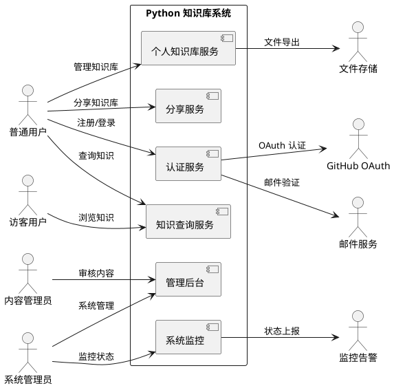
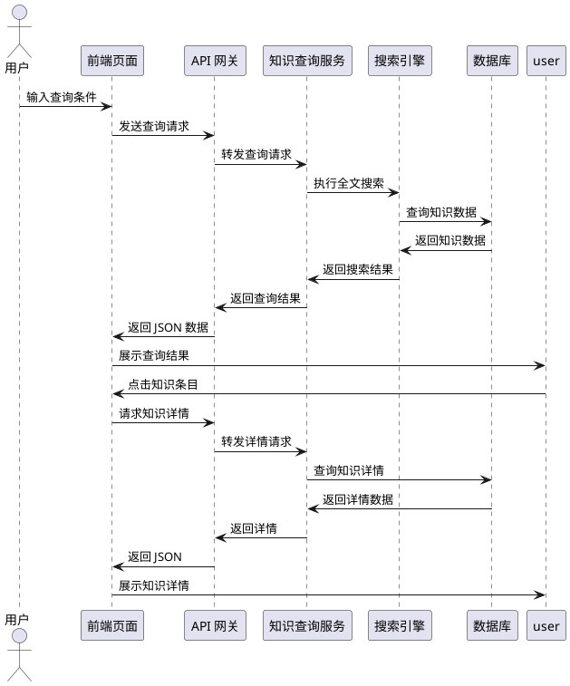
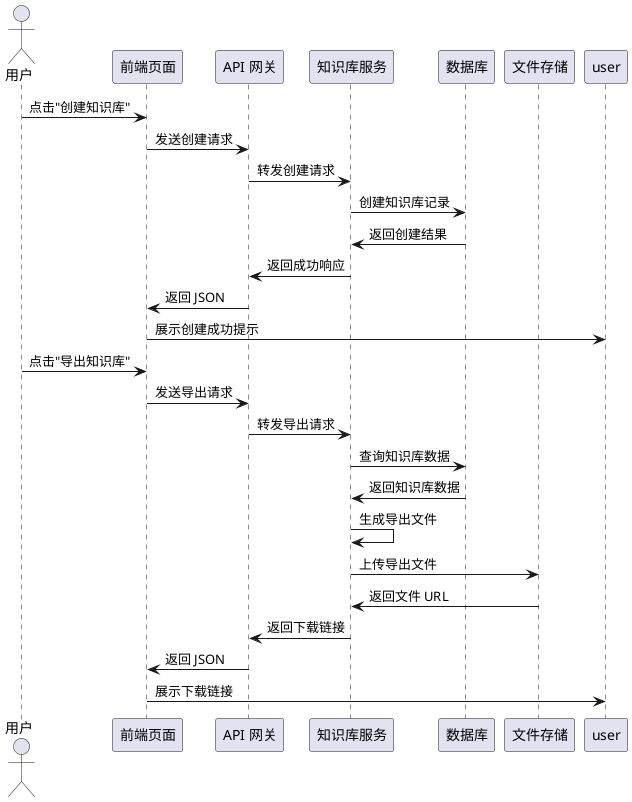
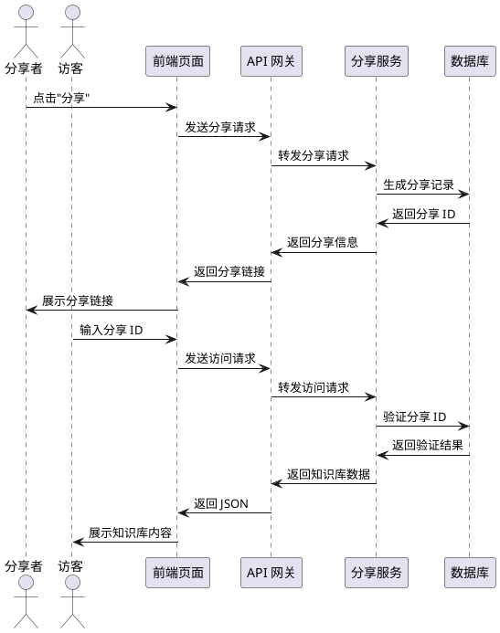
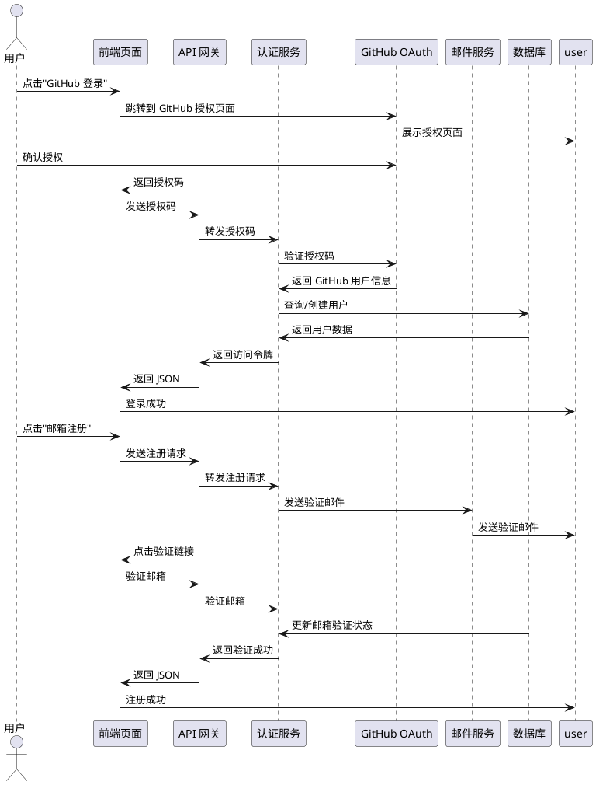
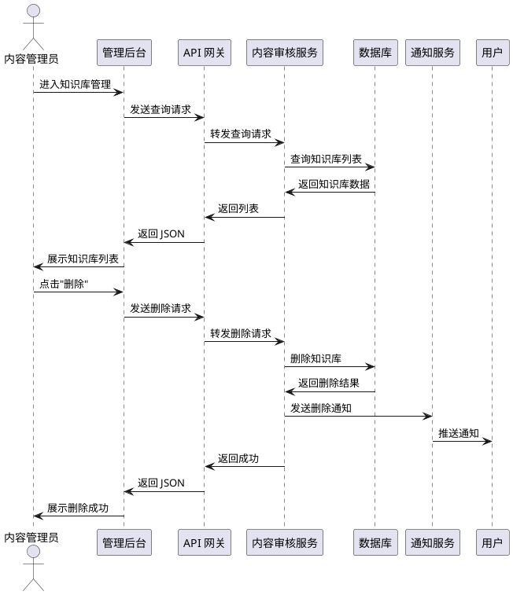
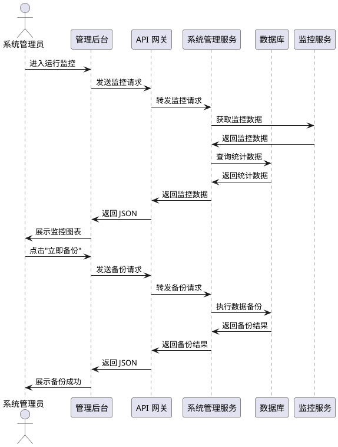

# **1. 组件定位**

## **1.1 核心职责**
本组件负责提供 Python 知识查询、用户个人知识库管理及分享服务，实现知识沉淀、检索与协作的核心价值。

## **1.2 核心输入**
1. 用户查询请求：用户通过搜索框、分类导航、标签筛选等方式发起的知识查询请求
2. 用户操作指令：用户创建、编辑、收藏、导出、分享知识库的操作指令
3. 管理员审核指令：管理员对违规内容进行审核、删除的管理指令
4. 认证授权请求：用户注册、登录、账号关联的认证请求
5. 系统配置指令：系统管理员对系统参数、监控数据、备份策略的配置指令

## **1.3 核心输出**
1. 知识查询结果：返回 Python 版本知识、库信息、框架文档、代码片段、配置文件等结构化数据
2. 用户知识库数据：返回用户个人知识库的目录结构、知识条目、分类标签
3. 分享链接：生成可访问的分享 ID 和 URL，供其他用户查看
4. 认证凭证：返回登录成功后的访问令牌、用户信息
5. 管理通知：向用户推送站内通知，向管理员返回系统状态报告
6. 导出文件：返回用户知识库的导出文件（JSON、Markdown、PDF 等格式）

## **1.4 职责边界**
本组件不负责：
1. Python 代码的实际执行与运行环境管理
2. 第三方库的安装、依赖管理与版本冲突解决
3. 用户知识库内容的版权审核与法律合规判定（仅做违规内容管理）
4. 系统底层运维（服务器监控、网络配置、安全防护）
5. 用户间的即时通讯与社交功能
6. 付费订阅与商业化交易流程

---

# **2. 领域术语**

**知识库（Knowledge Base）**
: 用户创建的、用于组织和存储 Python 相关知识的集合体，包含多个知识条目。
: 备注：分为系统知识库（预置）和个人知识库（用户创建）。

**知识条目（Knowledge Entry）**
: 知识库中的最小知识单元，包含标题、内容、分类、标签、来源等属性。
: 备注：可包含文本、代码片段、链接、附件等多种格式。

**分享 ID（Share ID）**
: 用户知识库分享时生成的唯一标识符，用于其他用户访问该知识库。
: 备注：格式为 32 位十六进制字符串，有效期可配置。

**版本知识（Version Knowledge）**
: 针对 Python 特定版本（3.8 ~ 3.12）整理的知识内容，包括新特性、变更说明、兼容性信息。
: 备注：版本知识为系统预置内容，不可由用户修改。

**代码片段（Code Snippet）**
: 可复用的 Python 代码示例，包含代码内容、说明、标签、适用版本等信息。
: 备注：支持语法高亮、复制、运行预览（仅展示，不执行）。

**违规内容（Violation Content）**
: 违反平台内容规范的用户生成内容，包括但不限于：广告、色情、暴力、侵权、虚假信息。
: 备注：违规内容由管理员审核后删除，并记录审核日志。

**账号关联（Account Linking）**
: 用户将多个认证方式（邮箱、GitHub）绑定到同一用户账号的操作。
: 备注：关联后可使用任一认证方式登录，共享同一用户数据。

---

# **3. 角色与边界**

## **3.1 核心角色**

**普通用户**
: 注册并登录系统的用户，可查询知识、创建个人知识库、收藏知识条目、分享知识库、导出知识库。

**内容管理员**
: 负责审核用户分享的知识库内容，删除违规内容，管理用户举报。

**系统管理员**
: 拥有最高权限，可管理系统配置、用户账号、知识库数据、系统监控、数据备份。

**访客用户**
: 未登录的用户，可浏览系统知识库、查看分享的知识库（需分享 ID）、注册账号。

## **3.2 外部系统**

**GitHub OAuth 服务**
: 提供 GitHub 账号认证授权服务，用户可通过 GitHub 账号注册和登录。

**邮件服务**
: 发送注册验证邮件、密码重置邮件、系统通知邮件。

**文件存储服务**
: 存储用户导出的知识库文件、上传的附件、系统备份文件。

**监控告警系统**
: 接收系统运行状态数据，触发异常告警通知。

## **3.3 交互上下文**

---

# **4. DFX 约束**

## **4.1 性能**

1. **知识查询响应时间**：系统知识库查询响应时间必须 ≤ 500 毫秒（P95）。
   a. 验收条件：在 1000 条知识条目并发查询场景下，95% 的查询请求响应时间 ≤ 500ms。

2. **页面加载时间**：首屏加载时间必须 ≤ 2 秒（P95）。
   a. 验收条件：在 100Mbps 网络环境下，95% 的页面首屏加载时间 ≤ 2s。

3. **并发处理能力**：系统必须支持 ≥ 1000 并发用户同时在线。
   a. 验收条件：在 1000 并发用户压力测试下，系统 CPU 使用率 ≤ 80%，内存使用率 ≤ 85%。

4. **搜索结果返回**：全文搜索结果返回时间必须 ≤ 1 秒（P95）。
   a. 验收条件：在 10000 条知识条目数据量下，95% 的全文搜索请求响应时间 ≤ 1s。

## **4.2 可靠性**

1. **系统可用性**：系统可用性目标 ≥ 99.5%。
   a. 验收条件：月度统计中，系统不可用时间 ≤ 3.6 小时。

2. **故障恢复时间**：系统故障恢复时间上限 ≤ 30 分钟。
   a. 验收条件：从故障发生到服务恢复的时间 ≤ 30min。

3. **数据一致性**：用户知识库数据必须保证强一致性。
   a. 验收条件：用户操作完成后，数据立即可见，无延迟。

4. **备份恢复**：系统必须支持每日自动备份，备份数据保留 ≥ 30 天。
   a. 验收条件：备份数据可在 1 小时内完成恢复，数据完整性校验通过。

## **4.3 安全性**

1. **认证方式**：系统必须支持邮箱 + 密码认证和 GitHub OAuth 认证。
   a. 验收条件：用户可使用邮箱或 GitHub 账号成功注册和登录。

2. **密码安全**：用户密码必须使用 bcrypt 算法加密存储，盐值长度 ≥ 16 位。
   a. 验收条件：数据库存储的密码字段为 bcrypt 哈希值，不可逆。

3. **敏感数据加密**：用户个人信息、分享 ID 等敏感数据必须加密传输（HTTPS）。
   a. 验收条件：所有 API 请求必须使用 HTTPS，HTTP 请求自动重定向到 HTTPS。

4. **操作审计**：所有管理员操作必须记录审计日志，保留 ≥ 180 天。
   a. 验收条件：审计日志包含操作人、操作时间、操作内容、IP 地址。

5. **内容安全**：用户生成内容必须进行 XSS 过滤和敏感词检测。
   a. 验收条件：包含 XSS 脚本的内容被自动转义，敏感内容被拦截。

6. **权限控制**：用户只能访问自己的知识库，分享知识库需通过分享 ID 访问。
   a. 验收条件：未授权用户访问他人私有知识库返回 403 错误。

## **4.4 可维护性**

1. **监控指标**：系统必须接入 CPU、内存、磁盘、请求量、错误率等基础监控指标。
   a. 验收条件：监控数据可实时查看，异常时触发告警。

2. **日志规范**：系统日志必须包含请求 ID、用户 ID、操作时间、操作内容。
   a. 验收条件：日志格式符合 JSON 规范，可通过 ELK 或类似工具检索。

3. **链路追踪**：关键操作必须支持链路追踪，可定位性能瓶颈。
   a. 验收条件：通过请求 ID 可追踪完整的请求处理链路。

## **4.5 兼容性**

1. **浏览器兼容**：系统必须支持 Chrome、Firefox、Safari、Edge 最新两个主版本。
   a. 验收条件：在支持的浏览器中，页面布局、功能交互正常。

2. **移动端适配**：系统必须支持移动端浏览器访问，响应式布局适配。
   a. 验收条件：在 375px ~ 1440px 屏幕宽度下，页面布局正常。

3. **API 兼容**：系统 API 必须遵循 RESTful 规范，版本化接口。
   a. 验收条件：API 路径包含版本号（如 `/api/v1/`），旧版本接口在 6 个月内保持兼容。

---

# **5. 核心能力**

## **5.1 知识查询**

### **5.1.1 业务规则**

1. **版本知识查询**：用户必须能够查询 Python 3.8 ~ 3.12 各版本的知识内容。
   a. 验收条件：选择 Python 3.10 版本后，系统返回该版本的新特性、变更说明、兼容性信息。

2. **分类知识查询**：用户必须能够按分类查询知识，包括：常用库、常用框架、常用工具、代码片段、配置文件、环境变量、命令、函数知识。
   a. 验收条件：选择"常用库"分类后，系统返回 NumPy、Pandas、Requests 等常用库信息。

3. **关键词搜索**：用户必须能够通过关键词搜索知识内容，支持模糊匹配和拼音搜索。
   a. 验收条件：输入"数据框"，系统返回 Pandas DataFrame 相关知识。

4. **标签筛选**：用户必须能够通过标签筛选知识内容，支持多标签组合筛选。
   a. 验收条件：选择"Web开发"+"Flask"标签，系统返回 Flask 框架相关知识。

5. **知识详情查看**：用户必须能够查看知识条目的完整内容，包括标题、内容、标签、来源、更新时间。
   a. 验收条件：点击知识条目，系统展示完整知识详情页面。

6. **收藏知识**：登录用户必须能够将知识条目添加到个人知识库。
   a. 验收条件：点击"收藏"按钮，知识条目被添加到用户的"默认知识库"。

7. **禁止项**：系统禁止用户查询、浏览、分享违法、违规、涉密知识内容。
   a. 验收条件：查询关键词包含敏感词时，系统返回"查询内容不符合规范"提示。

### **5.1.2 交互流程**

### **5.1.3 异常场景**

1. **查询结果为空**
   a. 触发条件：用户输入的关键词无匹配结果
   b. 系统行为：返回空结果列表，提示"未找到相关知识，请尝试其他关键词"
   c. 用户感知：页面展示空状态提示，推荐热门知识

2. **搜索服务超时**
   a. 触发条件：搜索引擎响应时间超过 3 秒
   b. 系统行为：返回超时错误，记录日志，触发告警
   c. 用户感知：页面展示"搜索超时，请稍后重试"提示

3. **数据库连接失败**
   a. 触发条件：数据库服务不可用
   b. 系统行为：返回 500 错误，记录错误日志，触发告警
   c. 用户感知：页面展示"系统繁忙，请稍后重试"提示

4. **敏感词拦截**
   a. 触发条件：查询内容包含敏感词
   b. 系统行为：拦截查询请求，记录审计日志
   c. 用户感知：页面展示"查询内容不符合规范"提示

---

## **5.2 个人知识库管理**

### **5.2.1 业务规则**

1. **创建知识库**：登录用户必须能够创建个人知识库，设置知识库名称和描述。
   a. 验收条件：点击"创建知识库"按钮，输入名称和描述，系统创建成功并跳转到知识库页面。

2. **编辑知识库**：知识库创建者必须能够编辑知识库的名称、描述、分类标签。
   a. 验收条件：点击"编辑"按钮，修改知识库信息，系统保存成功。

3. **删除知识库**：知识库创建者必须能够删除自己的知识库。
   a. 验收条件：点击"删除"按钮，确认删除后，系统删除知识库及所有知识条目。

4. **添加知识条目**：用户必须能够将查询到的知识添加到个人知识库。
   a. 验收条件：点击"添加到知识库"按钮，选择目标知识库，系统添加成功。

5. **编辑知识条目**：知识库创建者必须能够编辑知识条目的内容、标签、分类。
   a. 验收条件：点击"编辑"按钮，修改知识条目内容，系统保存成功。

6. **删除知识条目**：知识库创建者必须能够删除知识库中的知识条目。
   a. 验收条件：点击"删除"按钮，确认删除后，系统删除该知识条目。

7. **分类管理**：用户必须能够为知识库创建自定义分类，支持多级分类。
   a. 验收条件：点击"分类管理"按钮，创建、编辑、删除分类，系统保存成功。

8. **知识库导出**：用户必须能够将个人知识库导出为文件。
   a. 验收条件：点击"导出"按钮，选择导出格式（JSON、Markdown、PDF），系统生成下载链接。

9. **禁止项**：用户禁止在知识库中存储违法、违规、涉密内容。
   a. 验收条件：知识库内容包含违规内容时，系统自动检测并拦截。

### **5.2.2 交互流程**

### **5.2.3 异常场景**

1. **知识库名称已存在**
   a. 触发条件：用户创建知识库时，名称与已有知识库重复
   b. 系统行为：返回名称冲突错误，提示用户修改名称
   c. 用户感知：页面展示"知识库名称已存在，请修改"提示

2. **知识库不存在**
   a. 触发条件：用户访问不存在的知识库 ID
   b. 系统行为：返回 404 错误
   c. 用户感知：页面展示"知识库不存在或已被删除"提示

3. **无权限操作**
   a. 触发条件：用户尝试编辑/删除他人的知识库
   b. 系统行为：返回 403 错误
   c. 用户感知：页面展示"无权限操作"提示

4. **导出文件生成失败**
   a. 触发条件：导出文件生成过程中发生异常
   b. 系统行为：返回导出失败错误，记录日志
   c. 用户感知：页面展示"导出失败，请稍后重试"提示

---

## **5.3 知识库分享**

### **5.3.1 业务规则**

1. **生成分享链接**：用户必须能够将个人知识库生成分享链接（分享 ID）。
   a. 验收条件：点击"分享"按钮，系统生成分享 ID 和 URL，用户可复制分享。

2. **设置分享权限**：用户必须能够设置知识库的分享权限（仅查看、可评论、可收藏）。
   a. 验收条件：选择"仅查看"权限后，其他用户只能查看知识库内容，不能评论或收藏。

3. **查看分享知识库**：访客用户必须能够通过分享 ID 查看分享的知识库。
   a. 验收条件：输入分享 ID 或点击分享链接，系统展示知识库内容。

4. **取消分享**：知识库创建者必须能够取消分享，使分享链接失效。
   a. 验收条件：点击"取消分享"按钮，分享 ID 失效，其他用户无法访问。

5. **分享记录管理**：用户必须能够查看自己的分享记录，包括分享时间、访问次数。
   a. 验收条件：进入"分享管理"页面，系统展示所有分享记录。

6. **禁止项**：用户禁止分享违法、违规、涉密内容。
   a. 验收条件：分享内容包含违规内容时，系统自动拦截并通知用户。

### **5.3.2 交互流程**

### **5.3.3 异常场景**

1. **分享 ID 无效**
   a. 触发条件：访客输入无效的分享 ID
   b. 系统行为：返回分享 ID 无效错误
   c. 用户感知：页面展示"分享链接无效或已过期"提示

2. **分享已取消**
   a. 触发条件：知识库创建者取消分享后，访客仍尝试访问
   b. 系统行为：返回分享已取消错误
   c. 用户感知：页面展示"分享已取消"提示

3. **分享权限不足**
   a. 触发条件：访客尝试评论或收藏仅可查看的知识库
   b. 系统行为：返回权限不足错误
   c. 用户感知：页面展示"该知识库仅可查看，不支持评论/收藏"提示

4. **分享链接过期**
   a. 触发条件：分享链接设置了有效期，已过期
   b. 系统行为：返回分享过期错误
   c. 用户感知：页面展示"分享链接已过期"提示

---

## **5.4 用户管理**

### **5.4.1 业务规则**

1. **邮箱注册**：用户必须能够使用邮箱和密码注册账号。
   a. 验收条件：输入邮箱、密码、确认密码，系统发送验证邮件，用户点击验证链接后注册成功。

2. **邮箱登录**：用户必须能够使用邮箱和密码登录系统。
   a. 验收条件：输入邮箱和密码，系统验证成功后返回访问令牌。

3. **GitHub 注册登录**：用户必须能够使用 GitHub 账号注册和登录系统。
   a. 验收条件：点击"GitHub 登录"按钮，跳转到 GitHub 授权页面，授权后返回系统并自动注册/登录。

4. **账号关联**：用户必须能够将邮箱账号和 GitHub 账号关联到同一用户。
   a. 验收条件：在"账号关联"页面，点击"关联 GitHub"按钮，授权后两个账号关联成功。

5. **个人资料编辑**：用户必须能够编辑个人资料，包括昵称、头像、简介。
   a. 验收条件：点击"编辑资料"按钮，修改信息后保存成功。

6. **密码修改**：用户必须能够修改登录密码。
   a. 验收条件：输入原密码、新密码、确认新密码，系统验证原密码后修改成功。

7. **账号注销**：用户必须能够注销自己的账号。
   a. 验收条件：点击"注销账号"按钮，确认注销后，系统删除用户数据（保留审计日志）。

8. **禁止项**：用户禁止使用虚假信息注册、冒用他人账号、恶意注销账号。
   a. 验收条件：检测到异常注册行为时，系统自动拦截并记录。

### **5.4.2 交互流程**

### **5.4.3 异常场景**

1. **邮箱已注册**
   a. 触发条件：用户使用已注册的邮箱注册
   b. 系统行为：返回邮箱已注册错误，提示用户直接登录
   c. 用户感知：页面展示"邮箱已注册，请直接登录"提示

2. **密码强度不足**
   a. 触发条件：用户设置的密码不符合强度要求（至少 8 位，包含大小写字母和数字）
   b. 系统行为：返回密码强度不足错误
   c. 用户感知：页面展示"密码强度不足，至少 8 位，包含大小写字母和数字"提示

3. **邮箱验证码过期**
   a. 触发条件：用户点击验证链接时，验证码已过期（有效期 24 小时）
   b. 系统行为：返回验证码过期错误，提示用户重新发送验证邮件
   c. 用户感知：页面展示"验证码已过期，请重新发送验证邮件"提示

4. **GitHub 授权失败**
   a. 触发条件：用户取消 GitHub 授权或授权失败
   b. 系统行为：返回授权失败错误
   c. 用户感知：页面展示"GitHub 授权失败，请重试"提示

5. **账号关联冲突**
   a. 触发条件：用户尝试关联的 GitHub 账号已关联到其他用户
   b. 系统行为：返回关联冲突错误，提示用户先解绑
   c. 用户感知：页面展示"该 GitHub 账号已关联到其他账号"提示

---

## **5.5 知识库管理（管理员）**

### **5.5.1 业务规则**

1. **查看所有知识库**：内容管理员必须能够查看所有用户分享的知识库。
   a. 验收条件：进入"知识库管理"页面，系统展示所有知识库列表，支持按用户、时间、状态筛选。

2. **审核知识库**：内容管理员必须能够审核用户分享的知识库，判断内容是否合规。
   a. 验收条件：点击"审核"按钮，查看知识库内容，选择"通过"或"拒绝"。

3. **删除违规内容**：内容管理员必须能够删除违规的知识库。
   a. 验收条件：点击"删除"按钮，确认删除后，系统删除知识库并通知用户。

4. **用户举报处理**：内容管理员必须能够处理用户举报的知识库。
   a. 验收条件：进入"举报管理"页面，查看举报内容，处理举报并反馈。

5. **站内通知推送**：管理员必须能够向用户推送站内通知。
   a. 验收条件：点击"发送通知"按钮，输入通知内容，选择目标用户，系统发送成功。

6. **禁止项**：管理员禁止滥用权限、删除合法知识库、泄露用户信息。
   a. 验收条件：管理员操作必须记录审计日志，支持追溯。

### **5.5.2 交互流程**

### **5.5.3 异常场景**

1. **知识库不存在**
   a. 触发条件：管理员访问不存在的知识库 ID
   b. 系统行为：返回 404 错误
   c. 管理员感知：页面展示"知识库不存在"提示

2. **无权限操作**
   a. 触发条件：非管理员用户尝试访问管理后台
   b. 系统行为：返回 403 错误
   c. 用户感知：页面展示"无权限访问管理后台"提示

3. **删除失败**
   a. 触发条件：删除知识库时发生异常
   b. 系统行为：返回删除失败错误，记录日志
   c. 管理员感知：页面展示"删除失败，请稍后重试"提示

4. **通知发送失败**
   a. 触发条件：通知服务不可用
   b. 系统行为：返回通知发送失败错误，记录日志
   c. 管理员感知：页面展示"通知发送失败"提示

---

## **5.6 管理员功能（系统管理员）**

### **5.6.1 业务规则**

1. **用户管理**：系统管理员必须能够管理所有用户账号，包括查看、禁用、启用、删除。
   a. 验收条件：进入"用户管理"页面，系统展示所有用户列表，支持搜索、筛选、批量操作。

2. **权限管理**：系统管理员必须能够管理用户权限，包括角色分配、权限调整。
   a. 验收条件：在用户详情页面，可设置用户角色（普通用户、内容管理员、系统管理员）。

3. **系统配置**：系统管理员必须能够管理系统配置，包括数据库、缓存、日志、邮件等。
   a. 验收条件：进入"系统配置"页面，可修改配置项并保存生效。

4. **运行监控**：系统管理员必须能够查看系统运行状态，包括用户数量、知识库数量、分享数量、系统负载。
   a. 验收条件：进入"运行监控"页面，系统展示实时数据图表。

5. **数据备份**：系统管理员必须能够手动触发数据备份，查看备份记录，恢复备份数据。
   a. 验收条件：点击"立即备份"按钮，系统执行备份并生成备份记录。

6. **站内通知管理**：系统管理员必须能够管理站内通知，包括发送、查看、删除通知。
   a. 验收条件：进入"通知管理"页面，可发送通知、查看通知历史、删除通知。

7. **禁止项**：系统管理员禁止滥用最高权限、泄露系统配置、删除系统关键数据。
   a. 验收条件：系统管理员操作必须记录审计日志，支持追溯。

### **5.6.2 交互流程**

### **5.6.3 异常场景**

1. **配置保存失败**
   a. 触发条件：保存系统配置时发生异常
   b. 系统行为：返回配置保存失败错误，记录日志
   c. 管理员感知：页面展示"配置保存失败，请检查配置项"提示

2. **备份失败**
   a. 触发条件：备份过程中发生异常（磁盘空间不足、数据库连接失败）
   b. 系统行为：返回备份失败错误，记录日志
   c. 管理员感知：页面展示"备份失败，请检查磁盘空间和数据库连接"提示

3. **监控数据获取失败**
   a. 触发条件：监控服务不可用
   b. 系统行为：返回监控数据获取失败错误，记录日志
   c. 管理员感知：页面展示"监控数据获取失败，请稍后重试"提示

4. **恢复备份失败**
   a. 触发条件：恢复备份时发生异常（备份文件损坏、数据不一致）
   b. 系统行为：返回恢复失败错误，记录日志
   c. 管理员感知：页面展示"恢复失败，请检查备份文件完整性"提示

---

# **6. 数据约束**

## **6.1 用户（User）**

1. **用户 ID（id）**：用户唯一标识符，UUID 格式，全局唯一。
2. **邮箱（email）**：用户登录账号，必须符合邮箱格式，全局唯一，已验证。
3. **密码（password）**：用户密码，bcrypt 加密存储，至少 8 位，包含大小写字母和数字。
4. **昵称（nickname）**：用户显示名称，长度 2~20 个字符，支持中文、英文、数字、下划线。
5. **头像（avatar）**：用户头像 URL，可选，默认头像。
6. **简介（bio）**：用户个人简介，长度 0~200 个字符。
7. **GitHub ID（github_id）**：GitHub 用户 ID，可选，用于 GitHub 账号关联。
8. **GitHub 用户名（github_username）**：GitHub 用户名，可选。
9. **邮箱验证状态（email_verified_at）**：邮箱验证时间，未验证为 null。
10. **账号状态（status）**：账号状态，枚举值：active（正常）、disabled（禁用）、deleted（已注销）。
11. **创建时间（created_at）**：账号创建时间，ISO 8601 格式。
12. **更新时间（updated_at）**：账号信息更新时间，ISO 8601 格式。

## **6.2 知识库（KnowledgeBase）**

1. **知识库 ID（id）**：知识库唯一标识符，UUID 格式，全局唯一。
2. **创建者 ID（user_id）**：知识库创建者用户 ID，外键关联用户表。
3. **知识库名称（name）**：知识库名称，长度 1~50 个字符，不能为空。
4. **知识库描述（description）**：知识库描述，长度 0~500 个字符。
5. **分类标签（tags）**：知识库分类标签，JSON 数组格式，最多 10 个标签。
6. **分享状态（is_shared）**：是否分享，布尔值，默认 false。
7. **分享权限（share_permission）**：分享权限，枚举值：view_only（仅查看）、allow_comment（可评论）、allow收藏（可收藏）。
8. **分享 ID（share_id）**：分享唯一标识符，32 位十六进制字符串，可为空。
9. **分享有效期（share_expires_at）**：分享有效期，ISO 8601 格式，可为空。
10. **访问次数（view_count）**：知识库访问次数，整数，默认 0。
11. **收藏次数（favorite_count）**：知识库收藏次数，整数，默认 0。
12. **状态（status）**：知识库状态，枚举值：draft（草稿）、published（已发布）、archived（已归档）、deleted（已删除）。
13. **创建时间（created_at）**：知识库创建时间，ISO 8601 格式。
14. **更新时间（updated_at）**：知识库信息更新时间，ISO 8601 格式。

## **6.3 知识条目（KnowledgeEntry）**

1. **条目 ID（id）**：知识条目唯一标识符，UUID 格式，全局唯一。
2. **所属知识库 ID（knowledge_base_id）**：所属知识库 ID，外键关联知识库表。
3. **条目标题（title）**：知识条目标题，长度 1~100 个字符，不能为空。
4. **条目内容（content）**：知识条目内容，Markdown 格式，不能为空。
5. **条目类型（type）**：知识条目类型，枚举值：text（文本）、code（代码）、link（链接）、file（文件）。
6. **代码语言（code_language）**：代码语言，如 python、bash、json 等，可为空。
7. **标签（tags）**：知识条目标签，JSON 数组格式，最多 10 个标签。
8. **分类（category）**：知识条目分类，如 library、framework、tool、config、env、command、function。
9. **适用版本（python_version）**：适用 Python 版本，枚举值：3.8、3.9、3.10、3.11、3.12。
10. **来源（source）**：知识来源，如 official、community、user，默认 user。
11. **来源 URL（source_url）**：来源链接，可为空。
12. **排序权重（sort_order）**：排序权重，整数，默认 0。
13. **创建时间（created_at）**：条目创建时间，ISO 8601 格式。
14. **更新时间（updated_at）**：条目信息更新时间，ISO 8601 格式。

## **6.4 系统知识（SystemKnowledge）**

1. **知识 ID（id）**：系统知识唯一标识符，UUID 格式，全局唯一。
2. **知识类型（type）**：系统知识类型，枚举值：version（版本知识）、library（常用库）、framework（常用框架）、tool（常用工具）、code_snippet（代码片段）、config（配置文件）、env（环境变量）、command（命令）、function（函数知识）。
3. **知识标题（title）**：知识标题，长度 1~100 个字符，不能为空。
4. **知识内容（content）**：知识内容，Markdown 格式，不能为空。
5. **Python 版本（python_version）**：适用 Python 版本，枚举值：3.8、3.9、3.10、3.11、3.12，可为空。
6. **标签（tags）**：知识标签，JSON 数组格式，最多 10 个标签。
7. **热度（popularity）**：知识热度，整数，默认 0。
8. **是否置顶（is_pinned）**：是否置顶，布尔值，默认 false。
9. **创建时间（created_at）**：知识创建时间，ISO 8601 格式。
10. **更新时间（updated_at）**：知识信息更新时间，ISO 8601 格式。

## **6.5 分享记录（ShareRecord）**

1. **分享 ID（id）**：分享记录唯一标识符，UUID 格式，全局唯一。
2. **知识库 ID（knowledge_base_id）**：分享的知识库 ID，外键关联知识库表。
3. **分享者 ID（user_id）**：分享者用户 ID，外键关联用户表。
4. **分享 ID（share_id）**：分享唯一标识符，32 位十六进制字符串，全局唯一。
5. **分享权限（permission）**：分享权限，枚举值：view_only、allow_comment、allow收藏。
6. **分享有效期（expires_at）**：分享有效期，ISO 8601 格式，可为空。
7. **访问次数（view_count）**：分享访问次数，整数，默认 0。
8. **状态（status）**：分享状态，枚举值：active（有效）、expired（已过期）、revoked（已撤销）。
9. **创建时间（created_at）**：分享创建时间，ISO 8601 格式。
10. **更新时间（updated_at）**：分享信息更新时间，ISO 8601 格式。

## **6.6 通知（Notification）**

1. **通知 ID（id）**：通知唯一标识符，UUID 格式，全局唯一。
2. **接收者 ID（user_id）**：通知接收者用户 ID，外键关联用户表。
3. **通知标题（title）**：通知标题，长度 1~100 个字符，不能为空。
4. **通知内容（content）**：通知内容，不能为空。
5. **通知类型（type）**：通知类型，枚举值：system（系统通知）、admin（管理员通知）、share（分享通知）。
6. **是否已读（is_read）**：是否已读，布尔值，默认 false。
7. **创建时间（created_at）**：通知创建时间，ISO 8601 格式。

## **6.7 审计日志（AuditLog）**

1. **日志 ID（id）**：审计日志唯一标识符，UUID 格式，全局唯一。
2. **操作用户 ID（user_id）**：操作用户 ID，外键关联用户表，可为空（系统操作）。
3. **操作类型（action）**：操作类型，如 create、update、delete、login、logout、share、review。
4. **操作对象（object_type）**：操作对象类型，如 user、knowledge_base、knowledge_entry、system。
5. **对象 ID（object_id）**：操作对象 ID，可为空。
6. **操作内容（details）**：操作详情，JSON 格式。
7. **IP 地址（ip_address）**：操作 IP 地址。
8. **用户代理（user_agent）**：用户浏览器信息。
9. **创建时间（created_at）**：日志创建时间，ISO 8601 格式。
